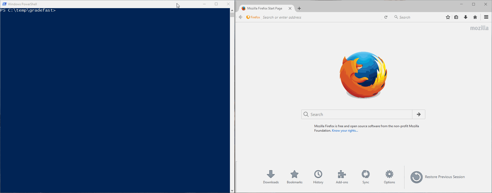

# GradeFast

*Automate and speed up your grading*

GradeFast is a Python program (with an HTML/JavaScript UI) that eliminates the repetitive parts of
grading programming assignments and lets you focus on what's important: helping students learn from
their mistakes. Best of all, it lets you help them without putting much time into it!

GradeFast has 2 components that work together: a command-line application that runs commands and
executes student assignments, and a web-based UI for entering grades and feedback.

## Dependencies

### Python

GradeFast requires **Python *3.5*** or later! (We use type hints.)

> NOTE: All the command line examples below use `python3` as the python executable. Depending on
> your platform, you may need to use `python` or `python.exe` instead (just make sure it's at least
> Python version 3.5!)

Additionally, these packages are required:

 - [YAML](https://pypi.python.org/pypi/PyYAML) to... I don't know... parse the input files, or
   something silly like that
 - [Flask](https://pypi.python.org/pypi/Flask) because... what doesn't ship with a web server these
   days?

Optional (but recommended) dependencies:

 - [Colorama](https://pypi.python.org/pypi/colorama) to make the CLI look pretty
 - [Mistune](https://pypi.python.org/pypi/mistune/) to parse Markdown in comments and feedback

You can install all these dependencies with:

    python3 -m pip install pyyaml flask colorama mistune

> It's recommended that you do this in a
> [virtualenv](http://python-guide-pt-br.readthedocs.io/en/latest/dev/virtualenvs/), especially if
> you don't have root privileges.

Additionally, some Python dependencies are included in the repository as git submodules. To get
these, after cloning, run:

    git submodule update --init

### JavaScript

The GradeBook user interface is browser-based (HTML/JavaScript). If you change any of the
JavaScript files, you will need to recompile them.

To install the Node dependencies and compile the JavaScript files, make sure you have a working
install of [Node.js](https://nodejs.org/) and [NPM](https://www.npmjs.com/), and then run:

    npm install
    npm run build

**If you modify the JavaScript source, make sure you recompile and include your changes in the pull
request!** This allows people to use GradeFast without having to install Node.js and NPM.

## Usage

Before running GradeFast, you need to compile the JavaScript components (see the JavaScript
dependencies above).

Then, to start GradeFast, run:

    python3 -m gradefast [OPTIONS] YAML-FILE

or, for more detailed usage:

    python3 -m gradefast --help

## But... how do I use this thing?

See the [GradeFast wiki](https://github.com/jhartz/gradefast/wiki).

**tl;dr:** First, you must make a YAML-formatted configuration file the assignment that you want to
grade. This file includes the structure of the grades and the commands to run on each submission.
For more info, see the
[YAML Configuration Format](https://github.com/jhartz/gradefast/wiki/YAML-Configuration-Format)
page on the GradeFast wiki.

There are also some utility scripts in the
[utilities folder](https://github.com/jhartz/gradefast/tree/master/utilities) that may be useful.

## Contributing to GradeFast

Want to delve deeper and contribute to GradeFast, or use individual parts of GradeFast as part of
your larger, superior project? Check out the
[Developer Documentation](https://github.com/jhartz/gradefast/wiki/Developer-Documentation) on the
wiki for more information on the GradeFast internals.

If you find a bug or want to add a (reasonable) feature, fork the repository and submit a pull
request on GitHub. Be sure to follow the [code style](STYLE.md).

## License

Licensed under the MIT License. For more, see the `LICENSE` file.

## Contact

Questions? Bugs? Concerns? Feedback? Contact <a href="https://jake.hartz.io/">Jake Hartz</a>.
